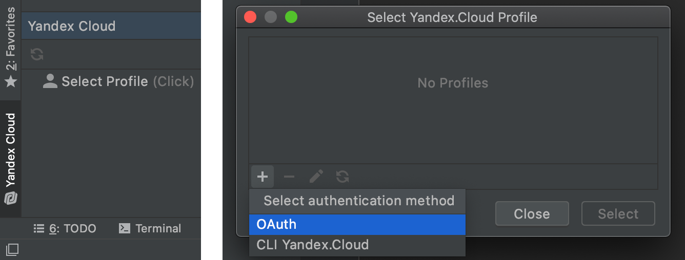
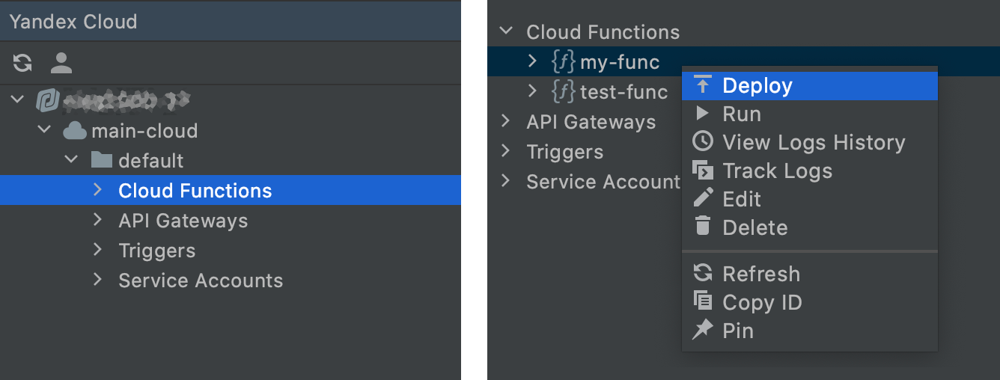

# Yandex.Cloud Toolkit для Intellij Platform

Плагин Yandex.Cloud Toolkit добавляет интеграцию с [Yandex.Cloud](https://cloud.yandex.ru/) в семейство IDE на [платформе IntelliJ](https://www.jetbrains.com/ru-ru/opensource/idea/) от [JetBrains](https://www.jetbrains.com).

## Возможности

* [Resource Manager](https://cloud.yandex.ru/docs/resource-manager/): управление ресурсами Yandex.Cloud.
* [Cloud Functions](https://cloud.yandex.ru/docs/functions/): управление функциями, загрузка версий, удаленный запуск, просмотр логов.
* [API Gateways](https://cloud.yandex.ru/docs/api-gateway/): управление API-шлюзами, просмотр и обновление спецификации.
* [Service Accounts](https://cloud.yandex.ru/docs/iam/concepts/users/service-accounts): управление сервисными аккаунтами, назначение ролей.

## Поддерживаемые IDE

Все IDE на платформе IntelliJ 2020.1+.

## Установка

### Способ 1. Репозиторий плагина

1. Добавьте репозиторий плагина `https://github.com/yandex-cloud/ide-plugin-jetbrains/releases/download/latest/updatePlugins.xml` в IDE.
1. Найдите через поиск плагин Yandex.Cloud Toolkit и установите его.

### Способ 2. Установка с диска

1. Скачайте или соберите нужную версию плагина Yandex.Cloud Toolkit.
1. Установите плагин с диска в IDE.

## Использование

1. Авторизуйтесь в Yandex.Cloud через OAuth или [CLI Yandex.Cloud](https://cloud.yandex.ru/docs/cli/). Для этого откройте окно `Yandex.Cloud` в нижнем левом углу IDE и выберите или создайте [аккаунт в Yandex.Cloud](https://cloud.yandex.ru/docs/iam/concepts/#accounts).

1. В окне `Yandex.Cloud` появятся ресурсы. Выберите нужный ресурс и действие из всплывающего меню.

   
## Сборка

Чтобы собрать плагин, запустите задачу Gradle:
`gradlew buildPlugin`  

Результат сборки:  
`./build/libs/yandex-cloud-toolkit-${version}.jar`

Дополнительные Gradle задачи:
* `buildRepository` — заполняет шаблон репозитория плагина;
* `printVersion` — выводит версию плагина для использования из GitHub Actions.

## Разработка

### Доработка

1. Добавьте новую функциональность.
1. Протестируйте плагин, запустив IDE через `gradle runIde`.
1. Дополните `CHANGELOG.md` для `Unreleased` версии, придерживаясь [формата](https://keepachangelog.com/en/1.0.0/).
1. Сделайте PR с изменениями.

### Релиз

1. Поднимите версию `pluginVersion` в `gradle.properties`.
1. Замените `Unreleased` на новую версию в `CHANGELOG.md`.
1. Если требуется, обновите описание плагина в `resources/pluginDescription.html` и `README.md`.
1. Отправьте изменения в ветку `origin/deploy`.
